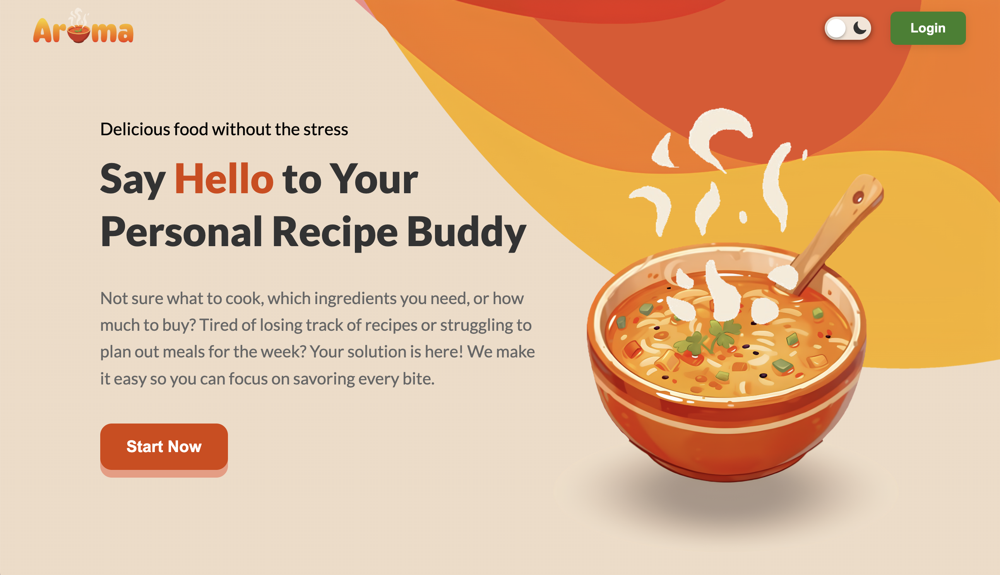

# Aroma

A website for all things recipes!

**Demo Video:** https://youtu.be/0A_lot3VZRs

## Inspiration

As college students, we are all too familiar with the struggle of deciding what to cook, figuring out how to cook, and knowing what to get when grocery shopping. We wanted a tool that simplifies the process, helping us keep track of recipes, plan out our meals, and create grocery lists effortlessly.

## What It Does

Aroma is a personal recipe and meal-planning assistant that helps users:

- **Save & Import Recipes:** store your favorite recipes or instantly import them from any website.
- **Generate Recipes:** get AI-generated recipes crafted just for you based on your available ingredients, dietary preferences, and more.
- **Plan Meals:** organize meals for the week using an interactive calendar.
- **Create Grocery Lists:** automatically generate shopping lists based on your meal plan.

## How We Built It

- **Languages & Frameworks:** Angular, TypeScript, and HTML/SCSS
- **API:** Node.js with Express, Puppeteer (for web scraping), OpenAI API
- **Database:** MongoDB to store recipes, meal plans, grocery lists, and user data.
- **Security:** JWTs (JSON Web Tokens) for secure user authentication.

## Challenges We Faced

- **Website Data Parsing:** Different websites are structured in different ways, so we had to find a way to extract the details we needed (e.g., ingredients, instructions, images) from any website.
- **AI Response Parsing:** When using the OpenAI API, the ChatGPT model didn’t always return data in the expected format, so we had to implement custom parsing to structure the output properly.
- **Responsiveness:** Since we envisioned that the website would likely most be used on a phone (e.g., during grocery shopping), we tried our best to ensure the website looked nice across different screen sizes.
- **Authentication:** We implemented secure user authentication with JWTs so different users could only access their own recipes, grocery lists, and other data.

## Accomplishments We're Proud Of

- Successfully built a full-stack meal planning and recipe management system.
- Implemented a beautiful, intuitive, and responsive UI using Angular.
- Integrated JWT authentication to ensure secure user logins and data protection.

## What We Learned

We deepened our knowledge in full-stack development, working with Angular, Express, and MongoDB while improving our ability to design a scalable and user-friendly application.

## How to Run

- In frontend, run `npm run start`
- In backend, run `npm run start`
